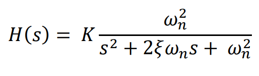
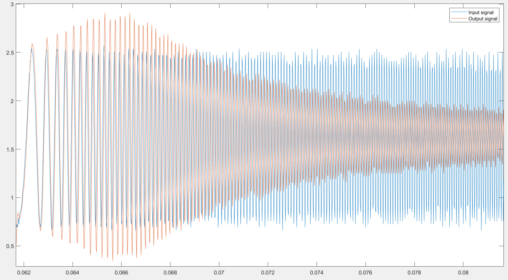
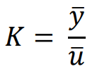
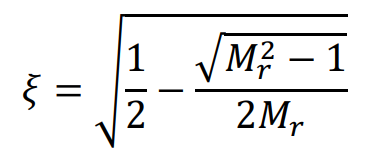
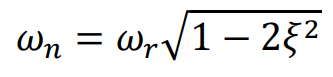
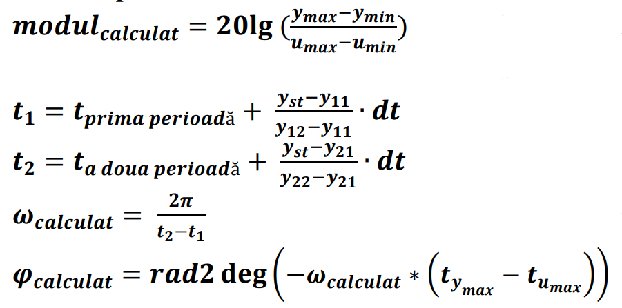

# Frequency-Response-calculator-based-on-the-resonance-phenomenon

**This is a modified version, the first version modified the signals and I decided to not do that**

This projects shows how you can calculate the `frequency response (Bode plots)` based on the output and input signals. The system has `2 poles and no zeros` and has the following transfer function:

The input and output signals are the following:

The `input signal (blue)` is a `sine wave` with variable frequency that has a `continuous component` and an `alternative component`, and also the noise is present.
The `output signal (red)` is also a `sine wave` with same characteristics as the input signal, but after it's start it shows the `resonance phenomenon` that modifies the modulus up to a maximum that we will call `resonance modulus` $M_r$.

First, we need to calculate the value of natural pulsation $\omega_n$, damping factor ζ, and proportionality factor $K$. I calculated them based on the following formulas:

 , which means that `K is the ratio between the mean value of y and the mean value of u`

 , which means that we can calculate ζ based on $M_r$

 , which means that we can calculate the $\omega_n$ based on the `value of the resonance pulsation ` $\omega_r$ `and ζ` 

For the Bode plot I used the MATLAB-calculated Bode values using the transfer function and to calculate the values from the signals I used the following formulas:

 

To calculate the pulsations precisely I used interpolation.
